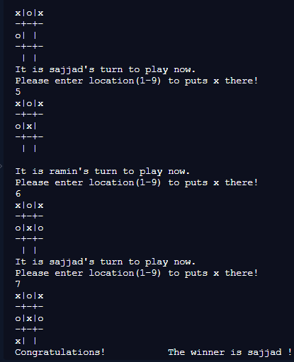

Microverse Ruby Project #3 -> Tic Tac Toe game (with Object Oriented Programming)

# ruby-tic-tac-toe



In this project we will recreate the well known Tic-Tac-Toe game by using object oriented programming paradigm. We have 4 milestones as below:

- [x] Miltestone 1 - Basic initial setups and linter configurations.
- [x] Miltestone 2 - CLI user interface is implemented.
- [x] Miltestone 3 - Game logic is implemented and the main user interface moved to Main class.
- [x] Miltestone 4 - Instructions and Rules for game

# Game Rules

- Two players can start game by entering their names
- Player names should contain at least one letter
- Game board consists of 3 by 3 grid and 9 locations.
- x sign for game belongs to Player1 and o sign belongs to Player2
- No player can put move in a place which is already filled
- Game board will check if a player wins after every move
- If no player wins it's a draw

## Built With

- Ruby,
- Rubocop

## Live Demo

[Live Demo Link](https://repl.it/@remki/ruby-tic-tac-toe-game-1#bin/main.a)


## Getting Started

To get a local copy up and running follow these simple example steps.

### Install
Besides the live demo link, you can run those functions in you own local environment. 
In order to run, you need to install RUBY in your computer. For windows you can go to [Ruby installer](https://rubyinstaller.org/) and for MAC and LINUX you can go to [Ruby official site](https://www.ruby-lang.org/en/downloads/) for intructions on how to intall it.
Then you can clone the project by typing ```git clone https://github.com/RaminMammadzada/ruby-tic-tac-toe-game/tree/develop```

### Run game
Type ```./bin/main.rb``` in the root file of the project. 
You can also type ```ruby bin/main.rb``` in the root file of the project.

### Run tests
In the terminal you just have to put the following command: 
```ruby tests.rb```


## Authors

👤 **Ramin Mammadzada**

- Github: [@RaminMammadzada](https://github.com/RaminMammadzada)
- Twitter: [@RaminMammadzada](https://twitter.com/RaminMammadzada)
- Linkedin: [@RaminMammadzada](https://www.linkedin.com/in/raminmammadzada) 

👤 **Sajjad Ahmad**

- Github: [@githubhandle](https://github.com/SajjadAhmad14)
- Twitter: [@twitterhandle](https://twitter.com/Sajjad_Ahmad14)
- Linkedin: [linkedin](https://linkedin.com/sajjad-ahmad-86102117a/)

👤 **Abdellani Youcef**

- Github: [@ABDELLANI-Youcef](https://github.com/ABDELLANI-Youcef)

- Twitter: [@YoucefAbdellani](https://twitter.com/YoucefAbdellani)

- Linkedin: [linkedin](https://www.linkedin.com/in/youcef-abdellani-b79361124/)

## 🤝 Contributing

Contributions, issues and feature requests are welcome!

Feel free to check the [issues page](issues/).

## Show your support

Give a ⭐️ if you like this project!

## Acknowledgments

- Microverse
- Odin project

## 📝 License

This project is [MIT](lic.url) licensed.
