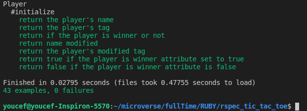

# Microverse Ruby Project #3 
# Tic Tac Toe game (with Object Oriented Programming)


In this project we have recreated the well known Tic-Tac-Toe game by using object oriented programming paradigm. We had 5 milestones as below:

- [x] Miltestone 1 - Basic initial setups and linter configurations.
- [x] Miltestone 2 - CLI user interface is implemented.
- [x] Miltestone 3 - Game logic is implemented and the main user interface moved to Main class.
- [x] Miltestone 4 - Instructions and Rules for game
- [x] Miltestone 5 - Unit Tests with Rspec for classes and methods.

## Game Rules

- Two players can start game by entering their names
- Player names should contain at least one letter
- Game board consists of 3 by 3 grid and 9 locations.
- x sign for game belongs to Player1 and o sign belongs to Player2
- No player can put move in a place which is already filled
- Game board will check if a player wins after every move
- If no player wins it's a draw

## Built With

- Ruby,
- Rubocop

## Live Demo

[Live Demo Link](https://repl.it/@remki/ruby-tic-tac-toe-game-1#bin/main.a)

## Run game
Besides the live demo link, you can run those functions in you own local environment. 

Type ```./bin/main.rb``` in the root file of the project. 

You can also type ```ruby bin/main.rb``` in the root file of the project.


## Run the tests
All public methods are tested with Rspec.

- Open a terminal window and type ```rspec```
- All tests should be passed:



#### Dependency Installations

- In order to run, you need to install RUBY in your computer. For windows you can go to [Ruby installer](https://rubyinstaller.org/) and for MAC and LINUX you can go to [Ruby official site](https://www.ruby-lang.org/en/downloads/) for intructions on how to intall it.
Then you can clone the project by typing ```git clone https://github.com/RaminMammadzada/ruby-tic-tac-toe-game/tree/develop```


- The game was tested using [RSpec](https://rspec.info/) which is a ruby testing tool. 
  - In a terminal window type ```gem install rspec```
  - Once rspec install has finished, go to project directory and type ```rspec --init```
  - You will see a folder spec and a file [.rspec](.rspec)
  - Inside spec folder you'll see a [spec_helper.rb](spec/spec_helper.rb) file.

## Authors

👤 **Ramin Mammadzada**

- Github: [@RaminMammadzada](https://github.com/RaminMammadzada)
- Twitter: [@RaminMammadzada](https://twitter.com/RaminMammadzada)
- Linkedin: [@RaminMammadzada](https://www.linkedin.com/in/raminmammadzada) 

👤 **Sajjad Ahmad**

- Github: [@githubhandle](https://github.com/SajjadAhmad14)
- Twitter: [@twitterhandle](https://twitter.com/Sajjad_Ahmad14)
- Linkedin: [linkedin](https://linkedin.com/sajjad-ahmad-86102117a/)

👤 **Abdellani Youcef**

- Github: [@ABDELLANI-Youcef](https://github.com/ABDELLANI-Youcef)
- Twitter: [@YoucefAbdellani](https://twitter.com/YoucefAbdellani)
- Linkedin: [linkedin](https://www.linkedin.com/in/youcef-abdellani-b79361124/)

## 🤝 Contributing

Contributions, issues and feature requests are welcome!

Feel free to check the [issues page](issues/).

## Show your support

Give a ⭐️ if you like this project!

## Acknowledgments

- Microverse
- Odin project

## 📝 License

This project is [MIT](lic.url) licensed.
